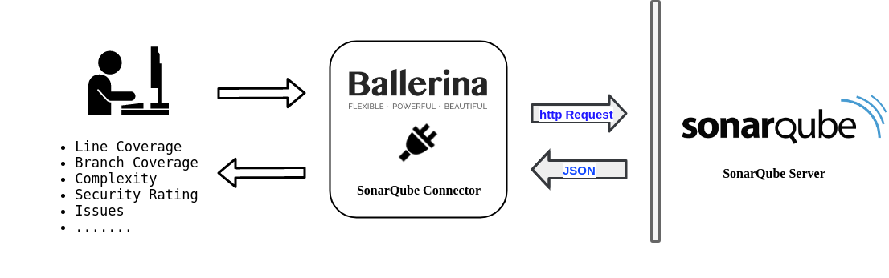

# Ballerina SonarQube Connector

*SonarQube is an open source platform developed by SonarSource for continuous inspection of code quality to perform automatic reviews with static analysis of code to detect bugs, code smells and security vulnerabilities on 20+ programming languages including Java (including Android), C#, PHP, JavaScript, C/C++, COBOL, PL/SQL, PL/I, ABAP, VB.NET, VB6, Python, RPG, Flex, Objective-C, Swift, Web and XML.* (https://www.sonarqube.org/).

The following sections provide you with information on how to use the Ballerina SonarQube connector.

- [Getting started](#getting-started)
- [Running Samples](#running-samples)
- [Quick Testing](#quick-testing)
- [Working with sonarqube connector actions](#working-with-sonarqube-connector-actions)

## Getting started

1. Create a ServerCredentials.conf file with following SonarQube server credentials.
- serverURL - SonarQube server URL
- authType - Authentication type (user or token)
- username - Your SonarQube account username.If the authentication type is "user" this parameter must be specified.
- password - Your SonarQube account password.If the authentication type is "user" this parameter must be specified.
- token - If the authentication type is "token" this parameter must be specified.
